<div style="margin: 0 100px 0 100px;  font-family: 'Times New Roman';"> 
<h1 style="text-align: center; font-weight: normal;">Path tracer in CUDA</h1>
<p style="text-align: center;">York Freiherr von Wangenheim yorfr185 <br>Martin Kaller marka727<p>
<p style="text-align: center;">May 15, 2024<p>

<div style="display: flex; justify-content: center; align-items:center; flex-direction: column;">
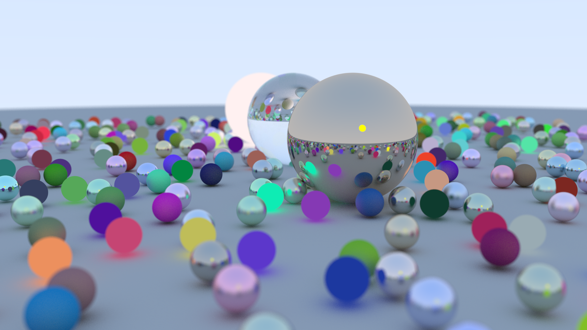</img>
</div>

## 1&emsp;Introduktion
Vår ambition var att skriva en ray tracer i CUDA, med focus på att få skriva GPU kod och optimisera. Följande är specifikationen vi utgick ifrån.

#### 1.1&emsp;Specifikationen
- Static offline ray tracer
    - 'Random' on the GPU. 
    - Spheres 
    - Ambient 
    - Shadows 
    - Reflection
    - Specularity 
    - Optimize for GPU
    - Balanced warps 
    - ~~Shared memory~~ constant memory 
    - ~~Memory coalescing~~
    - ~~Triangles instead of spheres~~


##### 1.1.1&emsp;Might do - offline
- Fuzzy shadows ✅
- Translucent fussiness ✅
- Motion blur
- Depth of field ✅
- Path tracing ✅
- Simple terrain
- Texture, perlin noise?


##### 1.1.2&emsp;Might do - Realtime
- Cuda-OpenGL interop, 'transfer data' without CPU
- Camera movement
- Using models
- Using terrain, frustum culling? Chunks?


## 2&emsp;Bakgrund

#### 2.1&emsp;Ray tracing in one weekend
    Ray tracing is one of the most elegant techniques in computer graphics.
        - Robert L. Cook (Distributed Ray Tracing, 1984)
"Ray Tracing in One Weekend" är en bok av Peter Shirley som gå igenom hur en enkel ray tracer fungerar i CPU kod. Boken går igenom hur man implementerar de viktigaste delarna av en ray tracer i kod, men även hur den fungerar teoretiskt. Vi utgick från boken, då vi var mest intresserad av GPU delarna istället för att implementera vår egna ray tracer.  

##### 2.1.1 Ray tracing in one weekend in CUDA
Vi följde även en guide (https://developer.nvidia.com/blog/accelerated-ray-tracing-cuda/) som beskriver vilka ändringar man behöver göra för att kunna följa boken "Ray tracing in one weekend" i CUDA, tex med att använda iteration istället för recursion, hur man använder CUrand för att få random på GPU:n. 
#### 2.2&emsp;Ray tracing vs path tracing
En ray tracer skickar ut strålar från kameran till scener och beräknar ljusintensiteten direkt vid varje träffpunkt, kollar om det blir en skuggstråle eller inte. En path tracer istället följer en ljusstrålens alla möjliga vägar genom scenen. Detta innebär att vi kan inkludera global ljus och illumination. Det innebär att det i princip omöjligt att implementera en path tracer som kör i realtid. 

Vi insåg efter att ha läst mer om path tracer och ray tracer, att vi implementerar en path tracer, när vi insåg att vi indirekt ljus. 

## 3&emsp;Implementation
Som tidigare nämnt så följde vi en guide på path tracing.

#### 3.1&emsp;CUDA
CUDA användes som programmeringsspråk i projektet. Detta val gjordes eftersom vi ville utforska CUDA mer ingående efter att ha läst kursen TDDD56. Till skillnad från OpenGL, som används för grafikrendering, är CUDA utvecklat för allmänna beräkningar på en GPU. Detta innebär att det inte finns ett enkelt sätt att direkt rendera bilder från GPU:n till skärmen. Istället sparas innehållet i frambufferten i en .ppm-fil efter varje rendering.
 
#### 3.2&emsp;Depth path tracing
Strålarna från en ray tracer samlar färg information `total_attenuation` längs vägen, men det kräver att strålen tillslut träffar en ljuskälla för att använda `total_attenuation`. Om strålen studsar "för mycket" så blir det `total_attenuation * (0,0,0)` vilket resulterat i svart färg.
I våran ray tracer är den största (ibland ända) ljuskällan himlen, vilket man får om man inte träffar något alls.
Sammanfattat, kan 3 följande hända för en stråle:
- För många studs (svart)
- Ingen träff (himmel)
- Material träff
    - studsa vidare
    - ljuskälla

Figur 1 visar en rendering med ett djup (inga studs) där vi endast  ser himlen samt några sfär som är ljuskällor. 

<div style="display: flex; justify-content: center; align-items:center; flex-direction: column;">
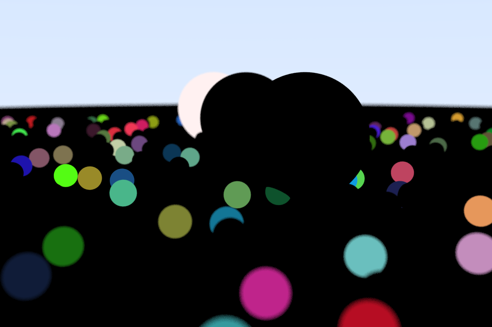</img>
Figur 1: Rendering med 1 djup.
</div>
<br>

I nästa rendering med 2 i djup, figur 2, ser vi sfär där strålen har träffat och sedan stutsat mot himlen. I reflektioner ser man endast ljuskällor.

<div style="display: flex; justify-content: center; align-items:center; flex-direction: column;">
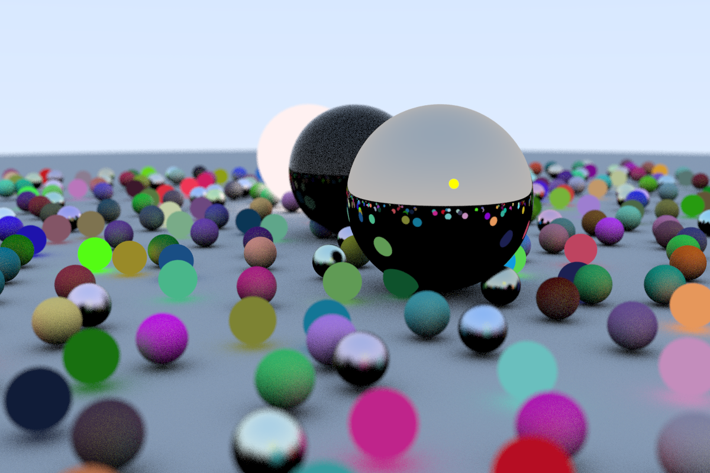</img>
Figur 2: Rendering med 2 djup.
</div>
<br>

I nästa rendering ser vi 4 i djup, figur 3, vilket räcker för de flesta reflektioner-

<div style="display: flex; justify-content: center; align-items:center; flex-direction: column;">
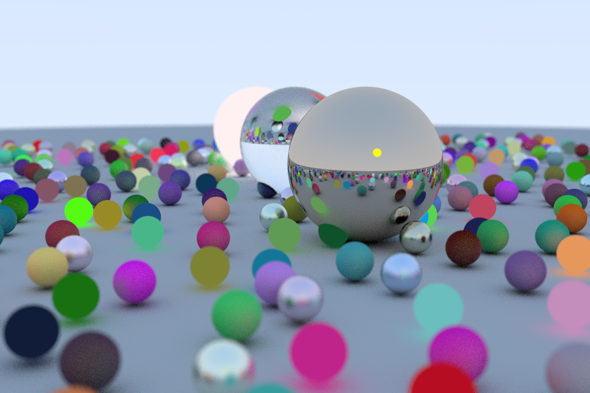</img>
Figur 3: Rendering med 4 djup.
</div>
<br>


#### 3.3&emsp;Distributed ray-tracing
På grund av att strålen måste träffa en ljuskälla, och att det finns väldigt mycket "randomness" involverat, så innebär det att en stråle ibland aldrig träffar en ljuskälla fast att det finns en väg till ljus. Man missar alltå ofta ljus.
I figur 4 ser man resultatet av att använda endast en stråle.

<div style="display: flex; justify-content: center; align-items:center; flex-direction: column;">
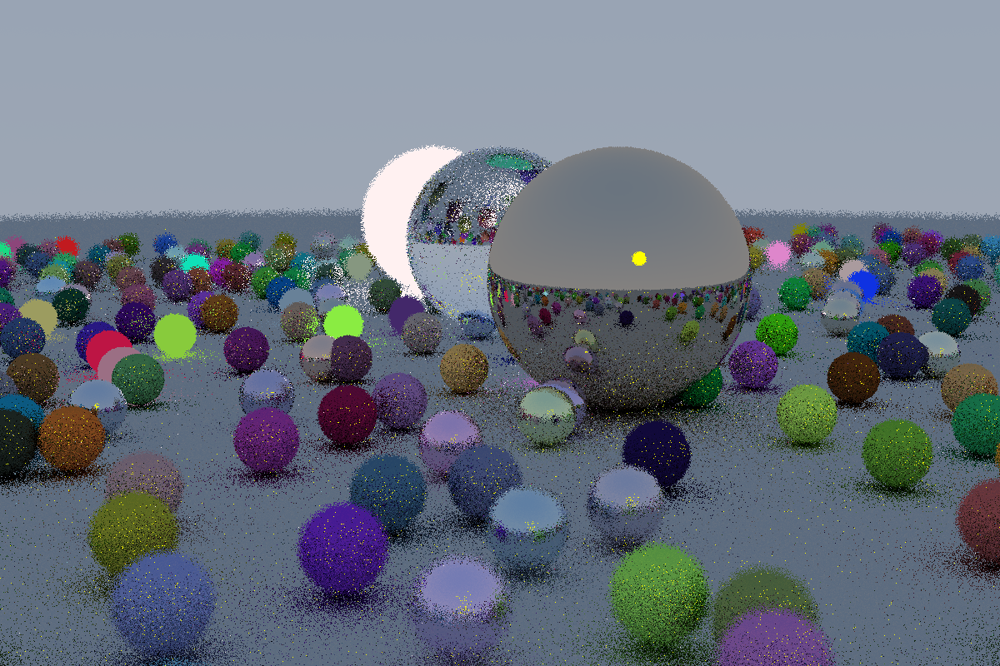</img>
Figur 4: Rendering med 1 ray per pixel.
</div>
<br>

Bilden blir väldigt grynig på grund av att pixlar som ligger bredvid varandra tar olika vägar. Om man istället använder flera strålar, som 4 rays per pixel, och sedan summerar så blir resultatet väldigt mycket mindre grynigt, som visualiserat i figur 5.

<div style="display: flex; justify-content: center; align-items:center; flex-direction: column;">
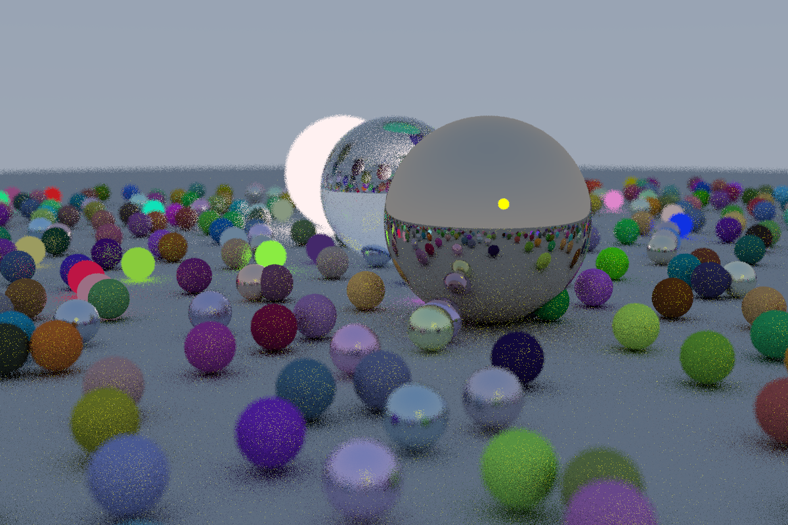</img>
Figur 5: Rendering med 4 rays per pixel.
</div>
<br>

När man summerar flera strålar från en pixel så får man en mer korrekt väg. Det agerar även som anti aliasing när man använder en väldigt hög rays per pixel. I figur 6 används 128 rays per pixel.

<div style="display: flex; justify-content: center; align-items:center; flex-direction: column;">
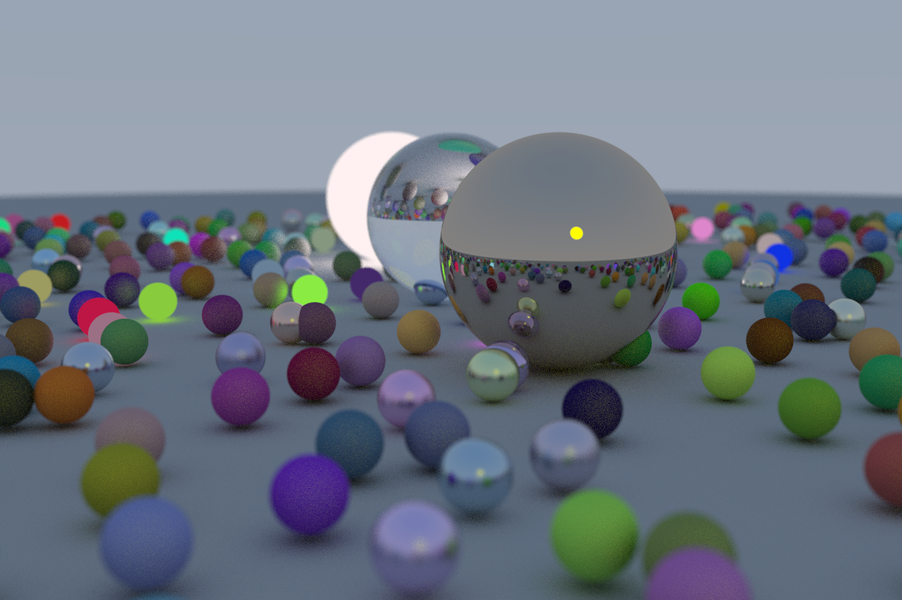</img>
Figur 6: Rendering med 128 rays per pixel.
</div>
<br>

Resultatet blir väldigt mjukt och runt, därav behövs ej anti aliasing.


#### 3.4&emsp;Material
En viktig aspekt i en path tracer är hur material interagerar med en ljusstråle. I vårt fall implementerade vi tre olika klassiska material och ett material som är en ljuskälla. Varje material har en egen färg, `albedo` och två olika funktioner, `bool scatter()` och `Color3 emit()`, där den första sprider ut strålarna beroende på materialets beteende och den andra ger ut ljus, om materialet kan det. 
##### 3.4.1&emsp;Lambertian
Ett lambertian material är ett diffus material som inte avger sitt eget ljus, istället studsar den ljusstrålen en slumpmässig riktning inom enhetssfären. Dessutom lägger den till sin egen färg/`albedo` på strålens färg/`attenuation`.
<div style="display: flex; justify-content: center; align-items:center; flex-direction: column;">
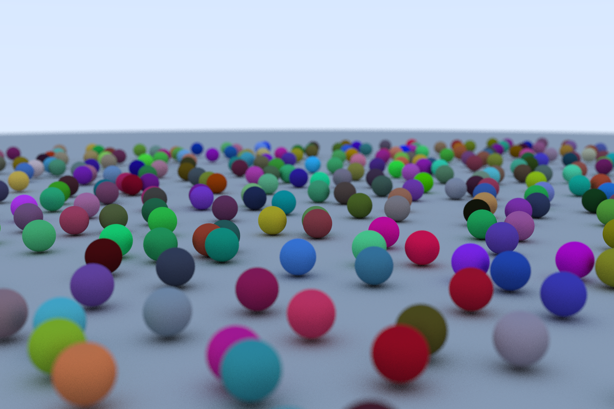</img>
Figur 7: Rendering med lambertian.
</div>
<br>

##### 3.4.1&emsp;Metal
Metal är ett material som reflekterar perfekt. Ett metal har också en variabel `fuzz`, som säger hur perfekt reflektionen ska vara, alltså en hög `fuzz` ger en metal som är matt, medans en låg ger metal som har precis har blivit polerad.  
<div style="display: flex; justify-content: center; align-items:center; flex-direction: column;">
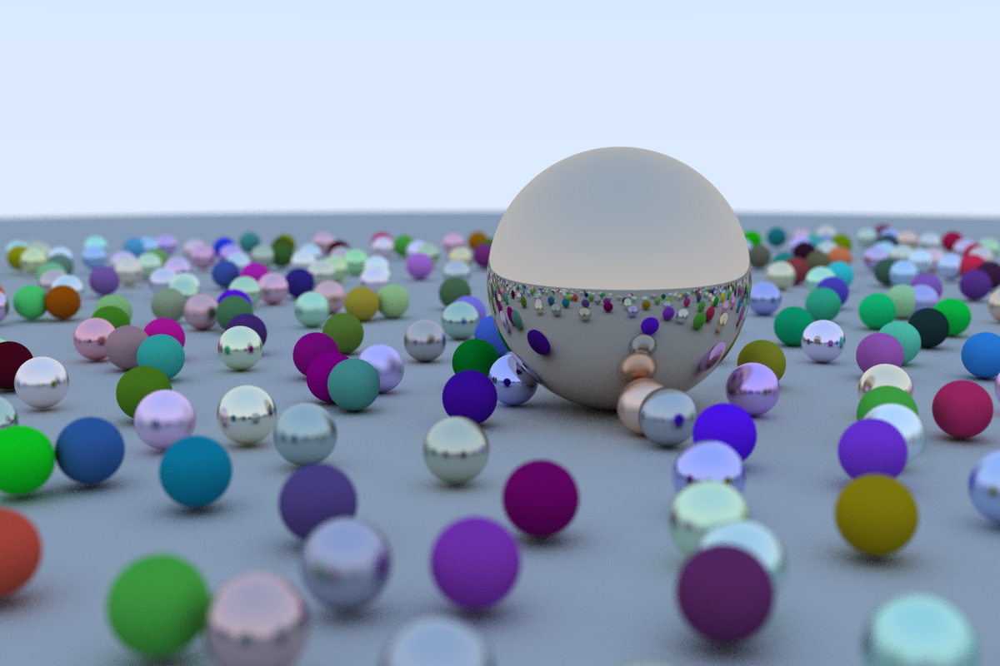</img>
Figur 8: Rendering med metal.
</div>
<br>

##### 3.4.1&emsp;Dielectric
Glass (eller glas) är ett material som bryter ljuset istället för reflekterar enligt Snells lag. Materialet har en `ref_idx` som bestämmer hur mycket ljuset ska brytas. 

<div style="display: flex; justify-content: center; align-items:center; flex-direction: column;">
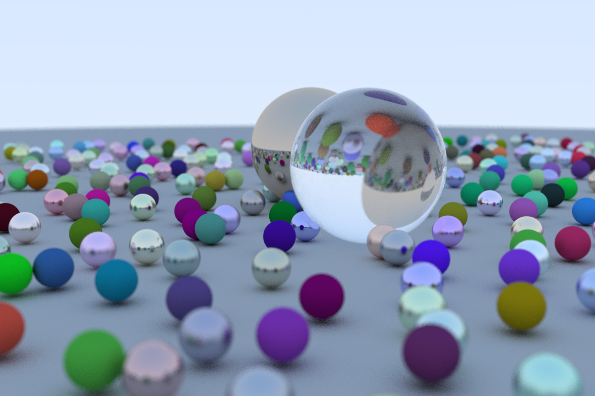</img>
Figur 9: Rendering med dielectric.
</div>
<br>

##### 3.4.1&emsp;Diffuse light
Detta är ett material som inte sprider strålen vidare och i emitted bara returnerar sin egen `albedo`. Där med blir det ett material som lyser i sin färg.

<div style="display: flex; justify-content: center; align-items:center; flex-direction: column;">
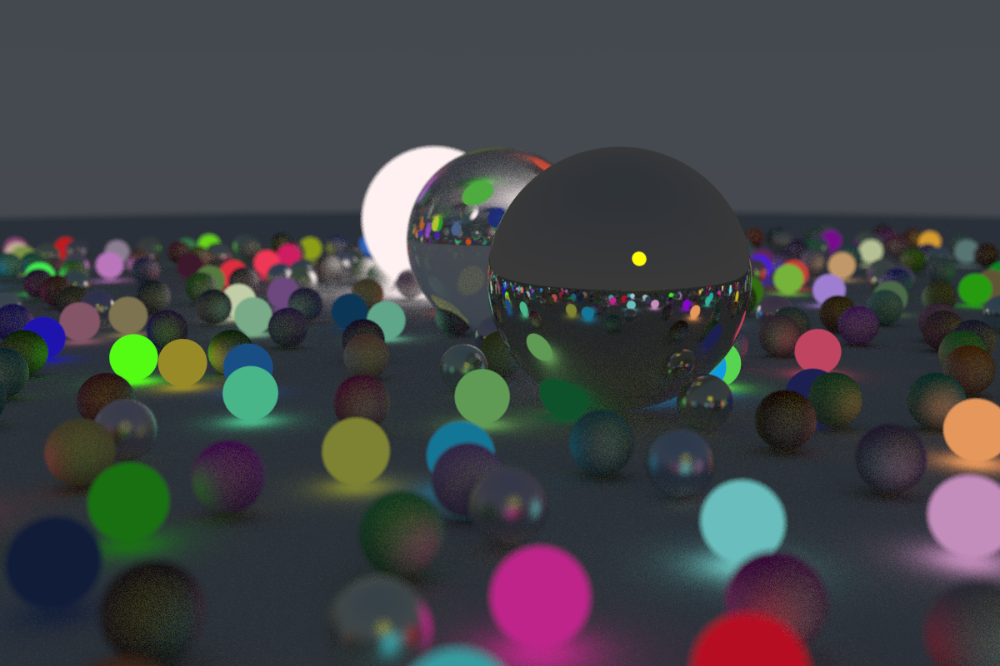</img>
Figur 10: Rendering med diffuse light.
</div>
<br>

## 4&emsp;Intressanta problem
På grund av att vi följde en guide på hur man skriver en path tracer så var de flesta av våra problem relaterade till, "Hur gör vi detta på en GPU?". Även fast att CUDA guiden täckte mycket så försökte vi till så stor del som möjligt implementera rakt från CPU ray tracern i "Ray tracing in one weekend" boken.

#### 4.1&emsp;För mycket random
Vårt största intresse var att optimera path tracern med hjälp av de GPU features (som shared memory) man får tillgång till via CUDA som man ej får tillgång till via portabel grafik som OpenGL.

En GPU jobbar dock bäst när den kan jobba "jämt" och en path tracer kräver väldigt "ojämna" beräkningar. Pågrund av att det är så mycket random involverat så kan två rays från samma pixel gå helt olika vägar, och göra helt olika beräkningar. Det fanns alltså inte så stora fördelar att ha tillgång till shared memory. Generellt i path tracing så är inte minnet en stor bottleneck, vilket var det första vi försökte optimera på.

Det finns nog mycket man kan optimera när det kommer till självaste beräkningarna och matematiska formlerna, men vi var mest intresserade av generella GPU optimeringar.

#### 4.2&emsp;Constant memory
En optimering vi såg var att "världen" som bestod av alla sfärer och material, låg i globalt minne. Första tanken var shared memory, men vi insåg att constant memory borde vara bättre.

När vi skapar en Sphere med ett material så användes new, vilket som i vanlig CPU-kod allokerar på heapen. I CUDA så är en del av det globala minnet dedikerat som heap. 
```cpp
new Sphere(..., new Lambertian(Color3(...)));
```
Pågrund av hur dessa datastrukturer är uppbyggda så är det väldigt klurigt att försöka definera dessa under compile time. Men CUDA har stöd för att överföra runtime minne till GPU constant.
```cpp
cudaMemcpyToSymbol(const_materials, tmp_materials, CONST_MEMORY_POOL_SIZE * sizeof(void *));
```
Nästa problem är dock att `Sphere` och `Material` är `__device__` kod, därav kan vi inte skapa upp det från GPU. Koden kan ej vara både `__host__ __device__` då de använder sig av `curand`.

Genom att temporärt allokera globalt minne på GPU så kan vi använda "placement new" för att lägga på vårt temporärt allokerade minne istället för heapen.
```cpp
__device__ void **addr(void **&tmp_const_memory_pool, size_t size)
{
    void **addr = tmp_const_memory_pool;
    //size is in bytes, += 1 jumps one void** (8 bytes)
    tmp_const_memory_pool += size/8;
    return addr;
}

#define NEW(a) new (addr(tmp_hitables, sizeof(a))) a
#define NEWM(a) new (addr(tmp_materials, sizeof(a))) a

NEW(Sphere)(Point3(...), ..., NEWM(Lambertian)(Color3(...)));
```
Med hjälp av en funktion som stegar fram pekaren på det temporära minnet samt makros så blir skapandet av `Sphere` och `Material` okej läsbart.

När detta överförs till constant memory så är dock alla pekare fel, därav så behövs lite "pointer arithmetics" för att peka om till constant minne, innan det överförs till constant minne.

```cpp
__global__ void move_material_pointer_to_const(Hitable **d_list, void** tmp_materials)
{
    Material *base_tmp = (Material *)tmp_materials;
    Material *base_const = (Material *)const_materials;
    for (size_t i = 0; i < HITABLES; i++)
    {
        ((Sphere*) d_list[i])->mat_ptr = ((Sphere*) d_list[i])->mat_ptr - base_tmp + base_const;
    }
}
__global__ void move_sphere_pointer_to_const(void **tmp_hitables, Hitable **d_list)
{
    Hitable *base_tmp = (Hitable *)tmp_hitables;
    Hitable *base_const = (Hitable *)const_hitables;
    for (size_t i = 0; i < HITABLES; i++)
    {
        d_list[i] = d_list[i] - base_tmp + base_const;        
    }
}
```
Därefter ligger hela "världen", som skapats i runtime, i constant memory.

Tyvärr såg vi minimal prestanda ökning, det beror möjligtvis på att CUDA redan gör väldigt mycket optimeringar, eller att vår constant memory access var för "ojämn" för att resultera i några signifikanta snabbare läsningar.

## 5&emsp;Slutsats
Path tracing ger väldigt fina renderingar, men kräver "ojämna" beräkningar som ej anpassar sig speciellt bra för att försöka minnes optimera på GPU.

</div>